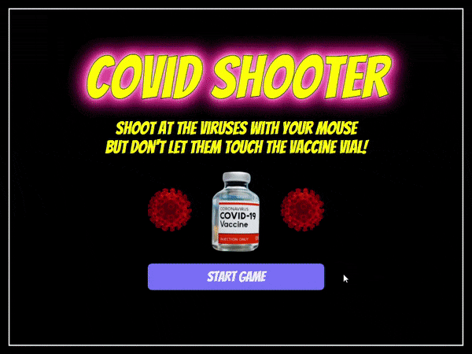

<h1 align="center">Hi, I'm Jonathan! Welcome to my page! 👋 </h1>


```
🗂️ jonathan 
  ├─ 📁 portfolio  
  │  ├─ 📁 CovidShooter/         # An interactive 2D shooting game shooting vaccine shots at the incoming coronaviruses.
  │  ├─ 📁 Netplex/              # A picture-perfect, single-page application of Netflix, a video streaming platform.
  │  └─ 📁 interView/            # A video interviewing platform where users can practice their interviewing skills and elicit feedback.
  ├─ 📁 education 
  │  ├─ 📄 App_Academy           # 16-week intensive course in full-stack software development with a 3% acceptance rate
  │  ├─ 📄 Cornell_University    # Master of Business Administration 
  │  ├─ 📄 Esade_Business_School # Master of Business Administration 
  │  └─ 📄 Binghamton_University # Bachelor of Science in Accounting
  ├─ 📁 experience 
  │  ├─ 📄 technology            # Wayfair, IBM, Amazon
  │  ├─ 📄 hedgefund             # Capstone Investment Addvisors, SS&C GlobeOp, Meridian Fund Services
  │  └─ 📄 non-profit            # Global Goods Partners
  └─ 📄 style.css 
```
<br />


<code></code>
<code></code>
<code></code>
<code></code>
<code></code>
<code></code>
<code></code>
<code></code>
<code></code>
<code></code>
<code></code>
<code></code>
<code></code>
<code></code>
<code></code>
<code></code>
<code></code>
<code></code>
<br/><br/>
 
<br/>

## Projects

### [Covid Shooter](https://hwkcode.github.io/CovidShooter/)
 
Covid Shooter is an interactive 2D shooting game using Javascript and HTML5 Canvas.

### [Netplex](https://netplex-app.herokuapp.com/#/)
 
Netplex is a picture-perfect, single-page application clone of Netflix, a video-streaming platform.

### [interView](https://interview-mern.herokuapp.com/#/)
 
interView is a video interviewing platform where users can practice their interviewing skills and elicit feedback.
